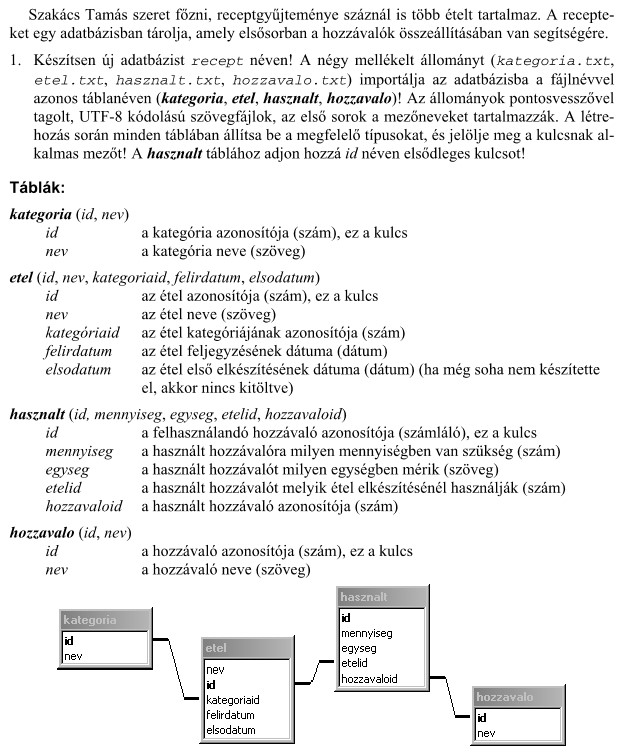
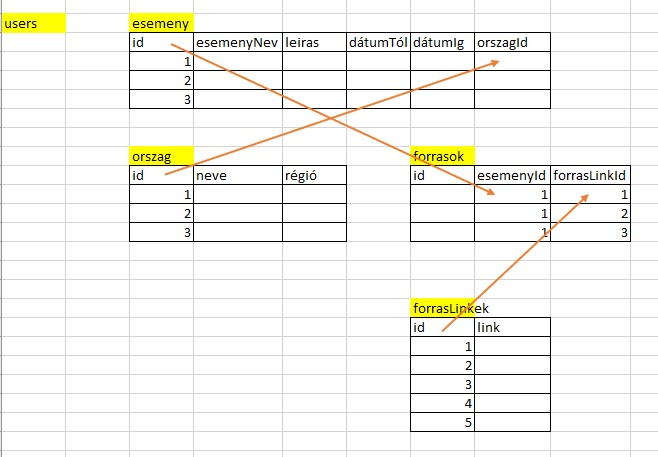
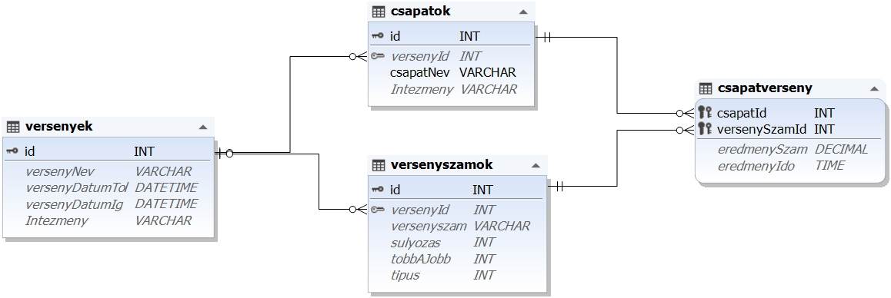
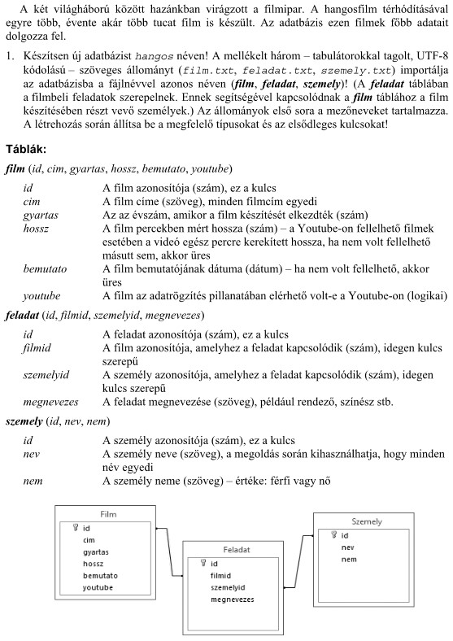
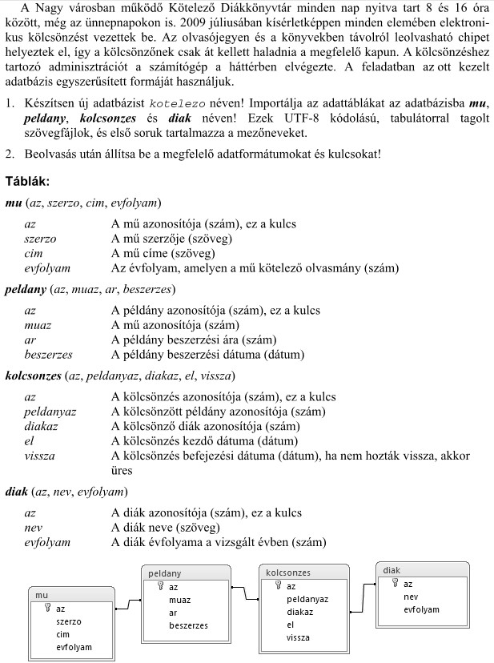

# Tartalom
- [Tartalom](#tartalom)
- [Ütemezés](#ütemezés)
    - [2023.02.20-26](#2023.02.20-26)
- [Általános feladtok](#általnos-feladtok)
  - [Fejlesztési környezet](#fejlesztési-környezet)
  - [Egyéb előírások](#egyéb-előírások)

- [Recept](#recept)
- [História](#historia)
- [Sportverseny](#portverseny)
- [Film](#film)
- [Kölcsönzés](#kölcsönzés)

# Ütemezés
## 2025. janauár vége környezet
- feladat megértés
- ütemterv elkészítés
- kommunikációs környezet kialakítás
- github saját repó létrehozás
- fejlesztési környezet létrehozás
## 2025. február adatbázis, backend
- adatbázis tervezés
- migráció
- diagram
- seederek
- teszt és éles adatbázis
- felöltés teszt adatokkal (tárolt eljárással)
- hitelesítés
- crud endpointok
- query endponintok
- kézi tesztek (request.rest)
- tesztek
    - unit
    - funkcionális
    - integrációs
- backend dokumentálás    
`document_database/projektnev.sql`

## 2025. március frontend
- frontend környezet felállítás
- menü szerkezet
- crud műveletek
- egyéb műveletek
- frontend tesztek
    - unit
    - funkcionális
    - integrációs
- frontend dokumentálás
## 2025. április
- utolsó simítások
- dokumentáció befejezés
- előadás elkészítése (ppt)
- előadás gyakorlása
    - angol nyelvű rész
    - magyar nyelvű rész
    - szereposztások

# Általános feladtok
A feladatot az alábbi előírásoknak megfelelően kell elkészíteni

## Fejlesztési környezet
- gitHub repo: 
    - kötelező
    - itt kell fejleszteni
    - a repo neve: a feladat neve
    - `RADME.md`
        - Mi ez a program
        - Itt kell leírni, hogy a feladatot hogy kell üzembe helyezni
    - `Technical description.md` (Műszaki leírás)
        - Le kell írni struktúráltan hogy működik a feladat, magyar nyelven.
        - Mappa struktúra
        - Adatbázis 
            - diagram
            - Teszt adatok
        - Backend leírása
            - sql gyűjtemény
            - Milyen modulok
            - Milyen fájlok
            - Data server
                - .env
                - Kapcsolódás az adatbázishoz
                - get, post, put, delete
                - middleware
                    - json
                    - cors
                    - autentikáció
            - Auth server
                - Bejelentkezés
                - Token
            - pingelés (request rest)

        - Frontend leírás
            - Mi a program célja
            - Milyen modulok
            - Milyen fájlok
                - store
                - komponensek
                - views
                - router
                - Oldal szerkezet
                    - Belépési pont: App.vue, main.js
                    - Head
                    - Menü
                    - Tatalom

    - `Users Guide.md` (Használati útmutató)
        - Le kell írni, képernyő képekkel hogy a produktumot hogy kell használni
    - `Presentation.ppt`  
        - Egy max 15 perces bemutató előadást támogató prozentáció
            - Személyes bemutatkozás
                - Mi a szakterület, mihez értek
                - Milyen terveim vannak
            - Mi a feladat célja
                - mit csinál
                - mit tud aprogram
                - bejelentkezés
            - Mi a feljesztési környezet
                - pl. Mysql adatbázis, Vusj kliens, Nodejs Backend, github
            - Milyen az adatbázis 
                - diagram, 
                - teszt adatok
                - Anyaggyűjtés
            - Be kell mutatni működés közben
            - Meddig jutottam el
            - Milyen irányban kell továbbfejleszteni
            - Egy kód részletet kiemelni és bemutatni

    - dokumentációs mappák:
        - `document_database`
            - `adatbázis modellje`: kép és fájl
            - `projektnev.sql`
                - Adatgerenerálás: tárolt eljárások, függvények
                - A backendben használt sql lekérdezések
            - biztonsági mentés
        - `server` mappa
            - Legyen egy adat szerver
            - Autentikációs szerver
            - npm csomagkezelés
        - `frontend` mappa
            - ide kerüljön a frontend, 
            - ami lehet teljesen független a szervertől
            - nem kötelező, hogy a szerver publikálja
            - npm csomagkezelés

## Egyéb előírások
- nyelvi előírások
    - Az objektumok (adatbázis, mező nevek, függvények, vátlozók stb. ) elnevezései angol nyelvűek.
    - A produktum működési felülete akármilyen nyelvű lehet.
    - Az adatbázis kódolásakor tartsa be a tiszta kód elveit.

- Működési környezet
    - A produktum elég, ha a feljesztő környezetben működik, nem kell élesben telepíteni.

- Autentikáció kötelező javasolt: jwt token
    - users tábla
    - Regisztráció
    - Login
    - Logout
    - Jogosutsági szintek
        - adminisztrátor: teljes joggal szerkesztheti az adatokat
        - vendég: olvashatja az adatokat
        - Az oldal betöltésekor kötelező vagy regisztrálni, vagy belépni.

# Recept
Csapattagok: Fehér Zsolt Dorián, Juhász Gergő

# História
Csapattagok: Kovács János, Jáger Kristóf

# Sportverseny
Csapattagok: Medgyes Csaba, Ledacs-Kiss Bence

# Film
Csapattagok: Molnár Krisztián, Hajdu István, Polyák Alex János

# Kölcsönzés
Csapattagok: Oláh Péter, Nagy Ferenc

